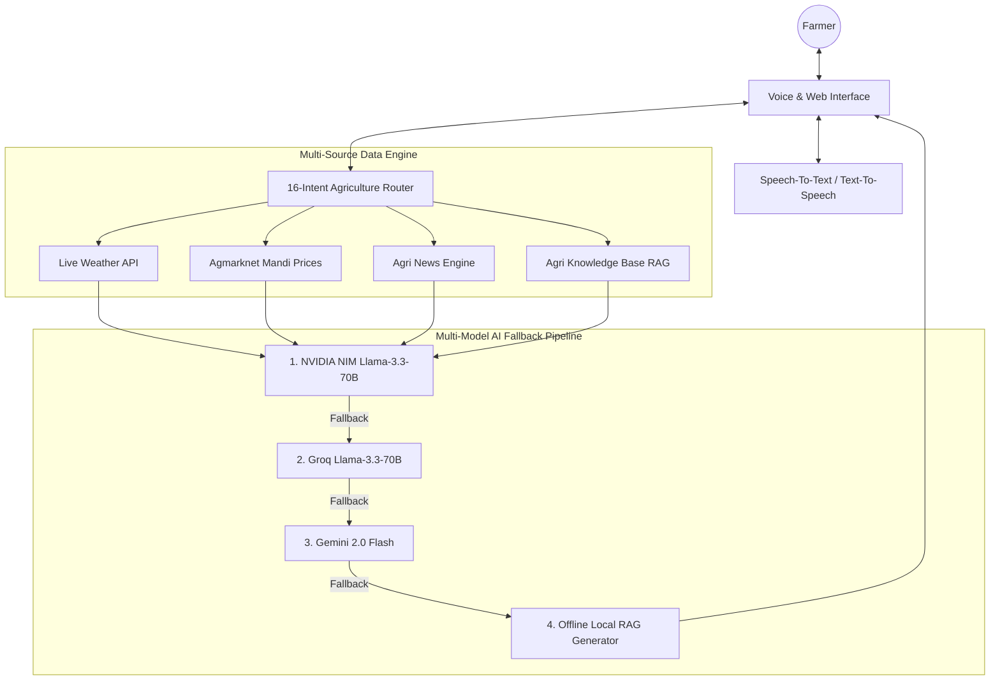

<div align="center">
  
  <h1>🌾 UZHAVAN AI (உழவன் AI)</h1>
  <p><b>Next-Gen Multilingual Agricultural AI Assistant & Intelligent Voice Call Bot</b></p>

  [](https://react.dev/)
  [](https://www.typescriptlang.org/)
  [](https://fastapi.tiangolo.com/)
  [](https://firebase.google.com/)
  [](https://build.nvidia.com/)
</div>

---

## 📌 Overview

**UZHAVAN AI** is a state-of-the-art agricultural intelligence platform built to empower farmers with real-time, multi-source actionable advice. Featuring an **Intelligent Voice Call Bot**, personalized **Crop Disease Prediction**, **Live Weather Advisories**, **Agmarknet Mandi Prices**, and **Agricultural News**, Uzhavan AI bridges the gap between complex agricultural science and rural farming communities across multiple languages (Tamil, English, Hindi, Telugu, Kannada, Malayalam).

---

## 🌟 Key Features

### 📞 1. Intelligent Multilingual Call Bot (`/screens/PhoneCall.tsx`)
- **16 Agricultural Intent Routing System**: Understands queries about Weather, Market Prices, Agricultural News, Crop Diseases, Prevention, Natural/Organic Remedies, Chemical Management, Crop Selection, Soil, Irrigation, Fertilizers, Pests, and Government Schemes.
- **Parallel Multi-Source Data Ingestion**: Concurrently queries Live Weather, Agmarknet Market Prices, News API, and Local Agricultural RAG Knowledge Base.
- **Multi-Model Intelligence Chain**: Runs primary inference on **NVIDIA NIM (Llama-3.3-70B)** with direct **Groq** and **Gemini 2.0 Flash** fallbacks, alongside a zero-downtime **Local Offline RAG Generator**.
- **Voice STT & Streaming TTS**: Supports Speech-to-Text and Text-to-Speech in Tamil, Hindi, Telugu, Kannada, Malayalam, and English.

### 🔬 2. Personalized Crop Disease Prediction (`/screens/DiseasePrediction.tsx`)
- **Profile Context Hydration**: Automatically personalizes disease diagnosis based on the authenticated farmer's registered crop (e.g., Carrot, Brinjal, Paddy, Tomato).
- **Comprehensive Remedies**: Delivers step-by-step symptoms, natural/organic management (Neem Oil, Trichoderma viride), chemical treatment with active ingredients & precise dosages, and prevention tips.

### 🌤️ 3. Weather & Farming Advisories (`/screens/Weather.tsx`)
- Real-time temperature, humidity, wind speed, rainfall alerts, and field operation advisories tailored for Tamil Nadu districts and Indian farming hubs.

### 📊 4. Agmarknet Market Price Intelligence (`/screens/MarketInsight.tsx` & `/screens/DailyPricePredictions.tsx`)
- Live mandi prices, daily commodity price trends, min/max rates, and market forecasts for informed crop selling.

### 📰 5. Agricultural News (`/screens/AgricultureNews.tsx`)
- Real-time agriculture news aggregator with language selection and state-level government announcements.

---

## 🛠️ Architecture & Tech Stack



- **Frontend**: React 18, TypeScript, Vite, Lucide Icons, TailwindCSS.
- **Backend Proxy**: FastAPI (Python 3.10+), Uvicorn, CORS-safe proxy handlers.
- **Data & Auth**: Firebase Authentication, Firestore Profile Storage, LocalStorage Persistence.
- **AI Models**: NVIDIA NIM (`meta/llama-3.3-70b-instruct`), Groq API, Google Gemini 2.0 Flash.

---

## 🚀 Quick Start Guide

### Prerequisites
- Node.js (v18+)
- Python (v3.10+)

### 1. Clone Repository
```bash
git clone https://github.com/Gopi45-gk/uzhavan-ai-1.git
cd uzhavan-ai-1
```

### 2. Frontend Setup
```bash
npm install
npm run dev
```

### 3. Backend Setup
```bash
cd backend
python3 -m venv venv
source venv/bin/activate  # On Windows: venv\Scripts\activate
pip install -r requirements.txt
uvicorn main:app --reload --port 8000
```

---

## 🛡️ License

Distributed under the MIT License. See `LICENSE` for more information.

<div align="center">
  <sub>Built with ❤️ for Indian Farmers by Team Uzhavan AI</sub>
</div>
